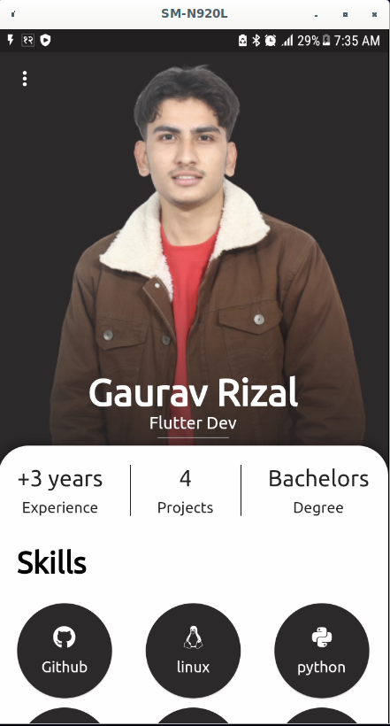
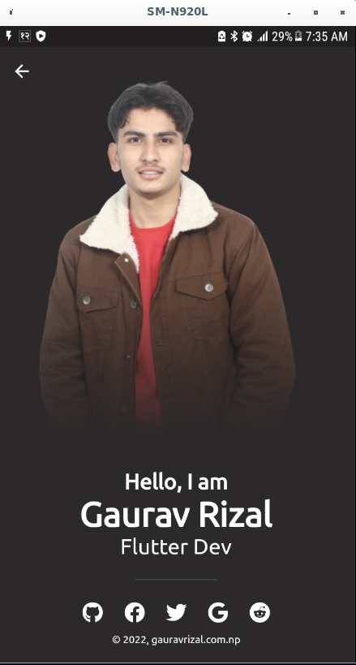
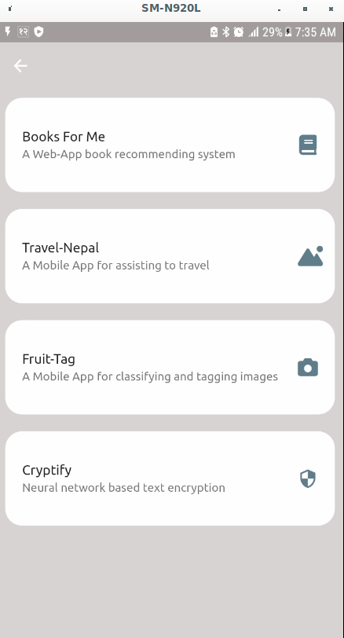

# Portfolio
It is a simple mobile-app portfolio designed to present an interesting outlook of oneself. In this portfolio, one can present his/her skills, their projects and also a brief introduction of themselves. It uses basic widgtes and this project was setup to give the workshop on 'Beginners guide to FLutter UI Development.

<b>HOME PAGE  

 
 
 
<b>About PAGE  

 
 
 

<b> Projects  

 

